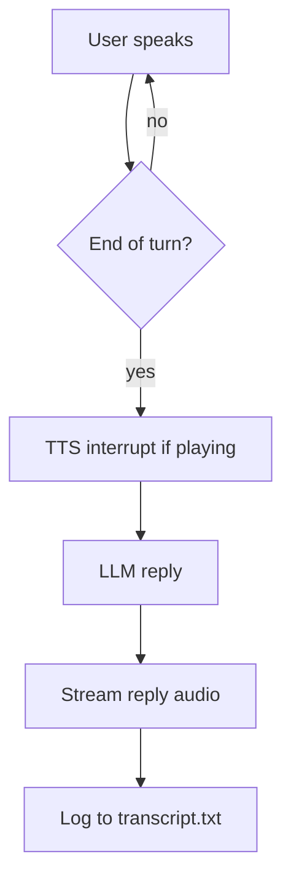

# Voice Agent

A real-time voice AI assistant pipeline: listen with a microphone, transcribe speech, run an LLM agent, and speak the reply aloud.

## Pipeline


## How it works

`main.py` owns the orchestration: it connects the transcriber, opens the mic stream, and runs an async loop that waits for each finished turn, interrupts any ongoing speech, generates the reply, and plays it.

| File       | Role                                             |
|------------|--------------------------------------------------|
| `main.py`  | Orchestrator — `VoiceAgent` loop and wiring      |
| `asr.py`   | Streaming ASR over WebSocket, turn queue, connect timeout |
| `llm.py`   | Agent with system prompt, tools, last-10-turn history |
| `tts.py`   | Streaming TTS with interrupt (barge-in) support  |
| `tools.py` | Tool implementations: bash allowlist, read file, project tree |
| `config.py`| Model ids, voice id, sample rates, API keys      |

Turn flow:



## Requirements

- Python 3.12+
- A working microphone and speaker
- API keys: AssemblyAI (STT), Groq (LLM), ElevenLabs (TTS)

## Setup

```bash
uv sync                 # or: pip install -e .
cp .env.example .env    # then fill in your API keys
```

## Run

```bash
uv run voice-agent      # or: .venv/bin/voice-agent
# or
uv run python -m voice_agent.main
```

Speak into your mic. Press `Ctrl+C` to stop. A running transcript is appended to `transcript.txt`.

## Configuration

All model ids, the voice id, sample rates, and API keys live in `src/voice_agent/config.py`:

| Component | Default |
|-----------|---------|
| ASR | `universal-3-5-pro`, 16 kHz mic input |
| LLM | `groq:openai/gpt-oss-20b` |
| TTS | `eleven_flash_v2_5`, PCM 22.05 kHz output |

TTS uses raw PCM (`pcm_22050`) so audio streams straight to PyAudio without decoding.

## Tools

The agent exposes three tools, all designed to be voice-friendly (output is truncated to ~1500 chars and summarized rather than recited):

| Tool | Backing class | Description |
|------|---------------|-------------|
| `bash_tool` | `BashTool` | Runs read-only shell commands from a fixed allowlist (`ls`, `pwd`, `cat`, `head`, `tail`, `grep`, `find`, `git`, `wc`, `echo`, `date`, `whoami`, `df`, `du`). Executed asynchronously with a 10 s timeout; anything outside the allowlist is rejected. |
| `readfile_tool` | `ReadFileTool` | Reads a text file's contents (truncated) from disk. |
| `get_tree_tool` | `GetTreeTool` | Lists project files, capped at 200 entries, ignoring `.git`, `__pycache__`, `venv`, `node_modules`, etc. |

`tools.py` also defines `WriteFileTool` and `EditFileTool` for writing/editing files, but they are not registered on the agent yet — the assistant stays read-only for now.

## Latency

Measured by the benchmark suite (`tests/test_latency.py`); latest numbers in `reports/latency_report.md`.

| Stage | This pipeline | Industry 2026 | Verdict |
|-------|---------------|---------------|---------|
| ASR streaming/turn | ~2.26 s | Deepgram Nova-3 ~150 ms, AssemblyAI ~200 ms | Inflated by test methodology — the whole clip is fired at once, not real-time-paced (see note) |
| ASR WebSocket connect | ~1.39 s | Not an industry-benchmarked metric — sockets open once per session and are reused | Only affects session startup, not steady-state latency |
| LLM time-to-first-token (Groq `gpt-oss-20b`) | ~497 ms | Groq typically sub-200–300 ms for short outputs | Likely network RTT from your location, not model speed |
| TTS first audio chunk (ElevenLabs Flash) | 215 ms | 100–250 ms standard; premium neural voices 250–500 ms | Healthy, mid-pack |
| TTS full synthesis | 309 ms | Same bracket | Fine |
| End-to-end (end of speech → audio starts) | ~900 ms–1.2 s (best-case)* | Vapi ~720 ms p50/1050 ms p95, Retell ~680/920 ms, Bland ~850/1180 ms, Twilio ConversationRelay ~491/713 ms | Acceptable, slightly noticeable; behind the fastest cascaded platforms |

\* Best-case estimate covering LLM + TTS only — ASR turn is mocked in the test, so real speech-to-speech latency is higher. Cascaded pipelines generally run 600–1200 ms end-to-end vs 300–700 ms for speech-to-speech.

## Benchmark

```bash
uv run pytest tests/test_latency.py -v    # requires API keys
.venv/bin/python scripts/generate_latency_report.py
```