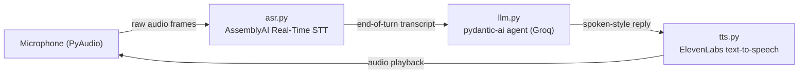

# Voice Agent

A real-time voice AI assistant pipeline: listen with a microphone, transcribe speech, run an LLM agent, and speak the reply aloud.

## Pipeline



`main.py` is the orchestrator: it wires up the event handlers, connects the transcriber, and runs the microphone streaming loop. Each module is self-contained:

| File       | Responsibility                                    |
|------------|---------------------------------------------------|
| `main.py`  | Orchestrator — event handlers, mic loop, `main()` |
| `asr.py`   | Real-time speech-to-text client + connect logic   |
| `llm.py`   | LLM agent (system prompt + tool registration)     |
| `tts.py`   | Text-to-speech playback                           |
| `tools.py` | Executable tools available to the agent           |

## Requirements

- Python 3.12+
- A working microphone
- API keys: AssemblyAI, Groq, ElevenLabs

## Setup

```bash
uv sync                 # or: pip install -e .
cp .env.example .env    # then fill in your API keys
```

## Run

```bash
uv run voice-agent      # or: .venv/bin/voice-agent
# or
uv run python -m voice_agent.main
```

Speak into your mic. Press `Ctrl+C` to stop. A running transcript is appended to `transcript.txt`.

## Notes

- ASR model: `universal-3-5-pro` (configurable in `asr.py`)
- LLM model: `groq:openai/gpt-oss-20b` (configurable in `llm.py`)
- The agent's `bash` tool only allows a fixed set of read-only commands (`ls`, `cat`, `date`, etc.)